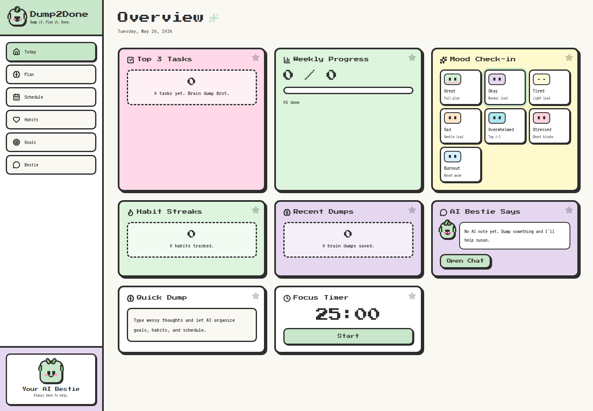

# Dump2Done

Dump2Done is a local-first AI planner that turns messy brain dumps into clear goals, tasks, habits, and schedules.

It is built for English, Malay, and Manglish inputs, with mood-aware planning so the app can suggest realistic work blocks when energy is low.

## Preview



## Features

- Brain dump to structured SMART goals, tasks, habits, and calendar items
- Mood check-ins with lighter planning for tired, stressed, overwhelmed, sad, or burnout days
- Today dashboard with top tasks, progress, habit streaks, recent dumps, and Bestie messages
- Planner, schedule, habits, goals, and chat views
- Local persistence through IndexedDB
- PWA manifest and service worker registration
- Local AI support through Ollama

## Tech Stack

- Next.js 14
- React 18
- TypeScript
- Tailwind CSS
- Zustand
- Lucide React
- Ollama for local AI planning

## Getting Started

### Prerequisites

Install:

- Node.js 18 or newer
- npm
- Ollama, if you want local AI planning

### Install Dependencies

```bash
npm install
```

### Set Up Local AI

Dump2Done uses Ollama locally. The default planning model is `qwen3:4b`.

```bash
ollama pull qwen3:4b
ollama serve
```

Optional smaller or larger models:

```bash
npm run ollama:pull:tiny
npm run ollama:pull:fast
npm run ollama:pull:smart
```

### Run the App

```bash
npm run dev
```

Open `http://localhost:3000`.

Alternative ports are available:

```bash
npm run dev:3001
npm run dev:3002
npm run dev:3003
```

## Available Scripts

```bash
npm run dev
npm run build
npm run start
npm run lint
npm run ports:windows
npm run ollama:serve
npm run ollama:pull:tiny
npm run ollama:pull:fast
npm run ollama:pull:smart
```

## Project Structure

```text
app/
  api/              API routes for planner and chat flows
  page.tsx          Main app UI
  layout.tsx        App metadata and PWA registration
lib/
  ai.ts             Prompting, fallback planning, parsing, and mood detection
  store.ts          Zustand state and local persistence flow
  idb.ts            IndexedDB helpers
  types.ts          Shared TypeScript types
public/
  sw.js             Service worker
scripts/
  kill-dev-ports.ps1
```

## Notes

- The app stores planner data locally in the browser.
- Ollama must be running at `http://127.0.0.1:11434` for AI generation.
- If local AI is unavailable, the planner API returns an error message so the UI can guide the user to start Ollama or use a faster model.

## License

This project is private unless a license is added.
